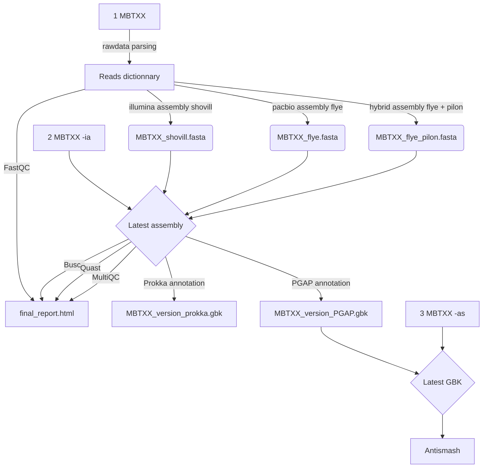

# Quasan

	--------------------------------------------------  
	________                                
	\_____  \  __ _______    ___________    ____    
	 /  / \  \|  |  \__  \  /  ___/\__  \  /    \   
	/   \_/.  \  |  // __ \_\___ \  / __ \|   |  \   
	\_____\ \_/____/(____  /____  >(____  /___|  /   
	       \__>          \/     \/      \/     \/   
	    (*Qu*ality - *As*sembly - *An*alysis )  
	--------------------------------------------------		
A pipeline for : Raw Reads QC -> Assembly -> Annotation -> Assembly QC -> BCG Discovery
## Overview

Here will be some nice pictures soon

## Installation

```bash
#Download using git clone from gitlab repo
git clone https://gitlab.services.universiteitleiden.nl/ibl-bioinformatic/streptidy.git
#If mamba already not in base environment
conda install -n base -c bioconda mamba
#Use the provided yaml file to create the environment easily
mamba env create -f quasan.yml
```

## Usage

```python
#Enlightenment soon to come
```

